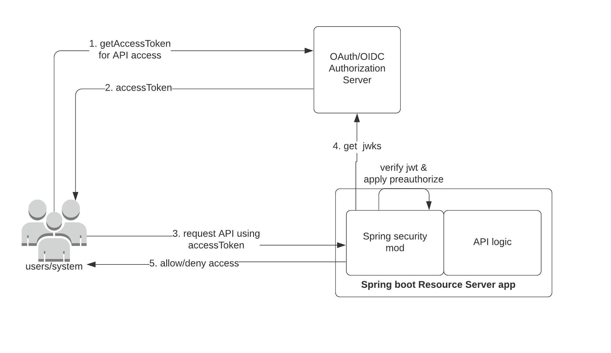

### Overview
This project has a sample Spring boot application with relevant configurations to model an API resource server.
The Resource server API's are assumed to be protected using an external Authorization Server(AS) which provides an 
accessToken(AT) to access the API's exposed by this resource server.



There are various capabilities demonstrated within this sample application such as:
* Resource server validating and accepting an accessToken issued by a trusted Authorization Server
* Resource server rejecting access to API resources, if presented with
  * no accessToken
  * invalid accessToken
  * accessToken from a different authorization server
  * "aud" claim within accessToken not matching one of the expected values
  * issuer does not match trusted authorization server
* Resource server enforcing scope based authorization checks to protect API resources
* Resource server has complete access to JWT information within accessToken to make other programatic decisions

### Configure using Cloudentity ACP as OAuth/OIDC server

Below steps shows how to configure [Cloudentity ACP](https://docs.authorization.cloudentity.com/info/concepts/oauth/authorization-servers/) 
as an OAuth authorization server that issues access tokens for a sample resource server built using Spring boot.
Cloudentity ACP issues a JWT as accessToken instead of an opaque token that enables easier integration for underlying web applications.

1. **Register application in OAuth server**

---
**NOTE**:
This can be any standard based OAuth Authorization server, Cloudentity ACP is used for reference as it is a fully FAPI compliant and certified OAuth/OIDC provider
---

Go to Cloudentity ACP and register a resource server & client application.

//TODO: Add a link to Cloudentity ACP documentation to define resource server


2. **Configure resource server application**

Once the resource server/service and scopes are defined in a remote OAuth authorization server, continue with 
below steps at the application level to configure and protect the resources using Authorization Server 
issued accessToken

All application properties are configurable and based on standard Spring integration under `src/main/resources/applciation.properties`

* Set the JWKS endpoint property - `security.oauth2.resource.jwk.key-set-uri`

This URI is used to get the key used to sign the accessToken by authorization server and 
verify integrity of the accessToken presented to resource server.

Sample entry:

```
security.oauth2.resource.jwk.key-set-uri=https://dev.ecs.authorization.cloudentity.com/default/default/.well-known/jwks.json
```

* Set the jwt enforcer properties

Below settings will ensure the presented accessToken is decoded(since it is a JWT) and the JWT 
properties are made available within the spring security context.

`resourceServerId` -> Must match one of the audience claims in the presented accessToken
`spring.security.oauth2.resourceserver.jwt.issuer-uri` -> Must match the issuer in the presented accessToken
`spring.security.oauth2.resourceserver.jwt.jwk-set-uri` -> Must match the jwks uri of the authorization server

Sample entry:

```
resourceServerId=bq5m6cnn3psqp63n4o4g
spring.security.oauth2.resourceserver.jwt.issuer-uri= https://dev.ecs.authorization.cloudentity.com/default/default
spring.security.oauth2.resourceserver.jwt.jwk-set-uri= https://dev.ecs.authorization.cloudentity.com/default/default/.well-known/jwks.json
```

### How to run

* Compile the application -  `mvn clean install`
* Run the application - `java -jar target/sample-resource-server-api-1.0-SNAPSHOT.jar`

Success message:

```
o.s.b.w.embedded.tomcat.TomcatWebServer  : Tomcat started on port(s): 8080 (http) with context path ''
c.c.springboot.samples.SampleApp         : Started SampleApp in 4.213 seconds (JVM running for 4.695)
```

### How to test

* Get an accessToken from authorization server

Get an accessToken from Cloudentity authorization server using Cloudentity demo application or using
any other tools like POSTMAN.

1. Test endpoint wihout valid accessToken

```
curl -X GET \
  http://localhost:8080/api/jwt/info \
  -H 'Authorization: Bearer <PUT_YOUR_ACCESS_TOKEN>' 
```

Response:

```
{
    "error": "unauthorized",
    "error_description": "Full authentication is required to access this resource"
}

```

*. Test an endpoint  with valid accessToken and get jwt information

```
curl -X GET \
  http://localhost:8080/api/jwt/info \
  -H 'Authorization: Bearer <PUT_YOUR_ACCESS_TOKEN>' 
```

Response:

```
{
    "error": "unauthorized",
    "error_description": "Full authentication is required to access this resource"
}

```

* Test an endpoint with scope protection enforced and an existing scope

```
curl -X GET \
  http://localhost:8080/api/sample/protected/openidscope \
  -H 'Authorization: Bearer <PUT_YOUR_ACCESS_TOKEN>' 
```

Response:

```
{
    "hasScope": "true"
}
```

* Test an endpoint with scope protection enforced but non existing scope

```
curl -X GET \
  http://localhost:8080/api/sample/protected/nonexistentscope \
  -H 'Authorization: Bearer <PUT_YOUR_ACCESS_TOKEN>' 
```

Response:

```
{
    "error": "access_denied",
    "error_description": "Access is denied"
}

```

