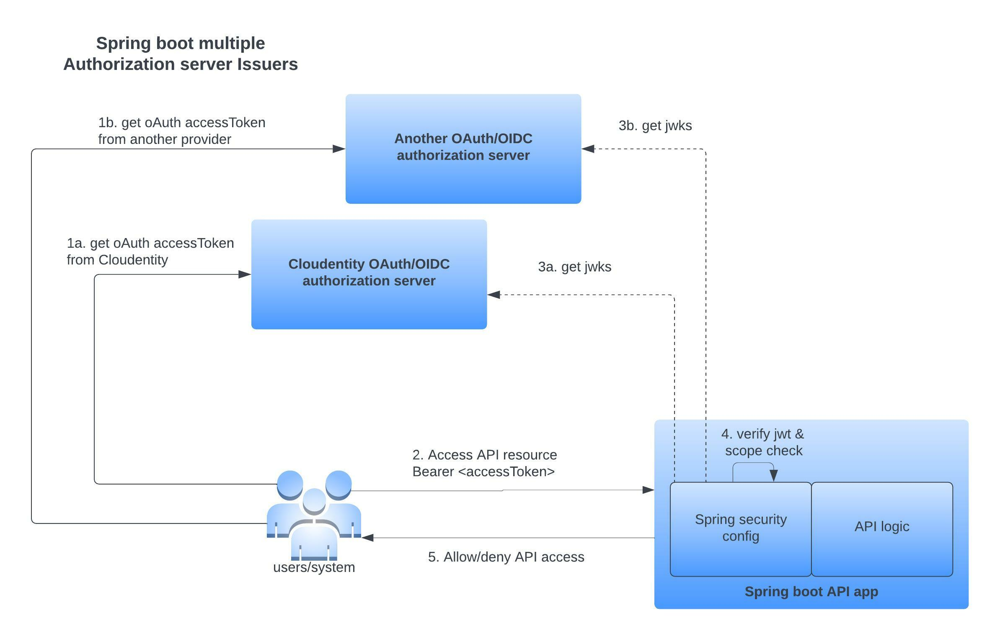

## Overview

Spring Boot makes it easy to create stand-alone, production-grade Spring based Applications that you can "just run". In this guide, we will configure a spring boot based API application that uses Spring Security to protect API endpoints. API endpoint access is enforced as per the [Bearer Token Usage specification for the The OAuth 2.0 Authorization Framework as defined in RFC6750](https://tools.ietf.org/html/rfc6750). Any party in possession of a bearer token (a "bearer") can use it to get access to the associated resources.

The [Spring boot](https://spring.io/projects/spring-boot) application models an API resource server and will be configured to trust the Bearer token issued by multiple OAuth authorization server(s). Cloudentity platform authorization server level multitenancy inherently allows you to model multiple authorization servers. In this guide, multiple workspaces can be created within a Cloudentity tenant and each of 
the OAuth authorization server can issue the OAuth access token and associated scopes within the Bearer token. Any API access within this application using the Bearer token from one of the above configured Cloudentity authorization servers will be protected by verifying that Cloudentity is the actual issuer of the token using Spring Security configurations.



Some of the main configurations showcased within this sample application are:
* Validate and accept only accessTokens issued by the configured trusted OAuth Authorization providers
* deny protected API resource access when accessed with
  * no accessToken
  * invalid accessToken
  * accessToken from a different OAuth authorization server other than the ones in trust list
  * issuer does not match trusted authorization server
* Programatic scope check for API resources

> NOTE: Another approach to ensure proper authorization is to offload the authorization 
> check to an upstream component like Api Gateway and ensure the service cannot be 
> accessed from any other component other the Api Gateway trust domain. This integration
> model is similar to a sidecar implemenation in service meshes, this way this
> entire token validation can be offloaded. [Cloudentity also provides an additional 
> authorizer component that can be plug into modern API GW ecosystems that can 
> validate, audit and enforce access policy for API resource access there by offloading
> that individual responsibility from the services 
> itself](https://developer.cloudentity.com/howtos/enforcement/authorizer_concept/)

## Cloudentity configuration

### Register API service within Cloudentity

[Register the API service within Cloudentity](https://developer.cloudentity.com/howtos/applications/create_service/) that depicts an OAuth resource server. During service registration, define the scopes related to this service as well.

Since we are demonstrating trusting multiple OAuth providers, we will use the built in workspace multitenancy feature within Cloudentity that allows independent OAuth authorization servers. Create multiple workspaces within Cloudentity and register the service and same associated scopes within each of the workspace. Each workspace is independent and represents an individual OAuth authorization server, hence the need to register the service twice in each workspace to showcase usage of multiple OAuth providers

## Configure Spring Boot application

Let's configure the spring boot application to define the trusted OAuth authorization provider(s), enforce resource control access and scope check.

### Define dependencies

It's very important that proper spring component dependencies are configured. Spring has moved most of the spring oauth capabilities into spring security.

* Using Maven

```xml
<parent>
    <groupId>org.springframework.boot</groupId>
    <artifactId>spring-boot-starter-parent</artifactId>
    <version>2.6.7</version>
  </parent>

  <properties>
    <java.version>1.8</java.version>
    <spring.security.version>5.6.3</spring.security.version>
    <spring.boot.autoconfigure.version>2.6.7</spring.boot.autoconfigure.version>
  </properties>

  <dependencies>
    <dependency>
      <groupId>org.springframework.boot</groupId>
      <artifactId>spring-boot-starter-web</artifactId>
      <version>${spring.boot.autoconfigure.version}</version>
    </dependency>

    <!-- Spring security dependencies -->
    <dependency>
      <groupId>org.springframework.security</groupId>
      <artifactId>spring-security-oauth2-resource-server</artifactId>
      <version>${spring.security.version}</version>
    </dependency>
    <dependency>
      <groupId>org.springframework.security</groupId>
      <artifactId>spring-security-core</artifactId>
      <version>${spring.security.version}</version>
    </dependency>
    <dependency>
      <groupId>org.springframework.security</groupId>
      <artifactId>spring-security-web</artifactId>
      <version>${spring.security.version}</version>
    </dependency>
    <dependency>
      <groupId>org.springframework.security</groupId>
      <artifactId>spring-security-config</artifactId>
      <version>${spring.security.version}</version>
    </dependency>
    <dependency>
      <groupId>org.springframework.security</groupId>
      <artifactId>spring-security-oauth2-jose</artifactId>
      <version>${spring.security.version}</version>
    </dependency>

  </dependencies>

```

* Using Gradle

```groovy
dependencies {
    implementation 'org.springframework.boot:spring-boot-starter-web:2.6.7'
    implementation 'org.springframework.security:spring-security-oauth2-resource-server:5.6.3'
    implementation 'org.springframework.security:spring-security-core:5.6.3'
    implementation 'org.springframework.security:spring-security-web:5.6.3'
    implementation 'org.springframework.security:spring-security-config:5.6.3'
    implementation 'org.springframework.security:spring-security-oauth2-jose:5.6.3'
}
```

### Configure multiple trusted authorization providers

Let's configure the multiple trusted authorization providers. It's done by providing
the trusted OAuth providers to the `JwtIssuerAuthenticationManagerResolver` instance
and then providing that to the http filter configuration for `oauth2ResourceServer `

In this below sample, you can see that we are trusting multiple issuers

```bash
 Issuer 1: "https://rtest.authz.cloudentity.io/rtest/ce-dev-playground-integrations"
 Issuer 2: "https://rtest.authz.cloudentity.io/rtest/ce-samples-oidc-client-apps"
```

```java
import org.springframework.http.HttpMethod;
import org.springframework.security.config.annotation.method.configuration.EnableGlobalMethodSecurity;
import org.springframework.security.config.annotation.web.builders.HttpSecurity;
import org.springframework.security.config.annotation.web.configuration.WebSecurityConfigurerAdapter;
import org.springframework.security.oauth2.server.resource.authentication.JwtIssuerAuthenticationManagerResolver;
import org.springframework.stereotype.Component;


@Component
@EnableGlobalMethodSecurity(securedEnabled = true, prePostEnabled = true)
public class ResourceServerAuthorizationConfig extends WebSecurityConfigurerAdapter {

  public void configure(HttpSecurity http) throws Exception {

    JwtIssuerAuthenticationManagerResolver authenticationManagerResolver = new JwtIssuerAuthenticationManagerResolver
        ("https://rtest.authz.cloudentity.io/rtest/ce-dev-playground-integrations",
            "https://rtest.authz.cloudentity.io/rtest/ce-samples-oidc-client-apps");

    http.csrf().disable()
        .authorizeRequests()
        .antMatchers(HttpMethod.OPTIONS, "/**").permitAll()
        .antMatchers("/actuator/**").permitAll()
        .anyRequest().authenticated()
        .and()
        .oauth2ResourceServer(oauth2 -> oauth2.authenticationManagerResolver(authenticationManagerResolver));
  }        
  }
}

```

`iss` within the JWT bearer token is used to construct the well known endpoint of the provider and then fetch the jwks uri to get the key used to verify the accessToken signature of the trusted authorization server. Thus the integrity of the accessToken presented to resource server is verified. The `iss` is accepted only if it is one of the values present in above configured providers.

### Configure API resource access protection

Let's configure the Spring web security to validate traffic

```java
import org.springframework.beans.factory.annotation.Value;
import org.springframework.http.HttpMethod;
import org.springframework.security.config.annotation.method.configuration.EnableGlobalMethodSecurity;
import org.springframework.security.config.annotation.web.builders.HttpSecurity;
import org.springframework.security.config.annotation.web.configuration.WebSecurityConfigurerAdapter;
import org.springframework.stereotype.Component;

@Component
@EnableGlobalMethodSecurity(securedEnabled = true, prePostEnabled = true)
public class ResourceServerAuthorizationConfig extends WebSecurityConfigurerAdapter {

  public void configure(HttpSecurity http) throws Exception {
    http.csrf().disable()
        .authorizeRequests()
        .antMatchers(HttpMethod.OPTIONS, "/**").permitAll()
        .antMatchers("/actuator/**").permitAll()
        .anyRequest().authenticated()
        .and()
        .oauth2ResourceServer()
        .jwt();
  }
}
```

### Configure scope check

Let's configure the scope check required for resource access. Scope check can be enforced
using the `Preauthorize` annotation with `hasAuthority` method and the scope of the resource.
Sample usage of the annotation is ` @PreAuthorize("hasAuthority('SCOPE_openid')")` which indicates that `openid` scope is required in the Bearer token presented to access the specific API resource on which this annotation is applied.

```java
import java.util.HashMap;
import java.util.Map;
import org.springframework.security.access.prepost.PreAuthorize;
import org.springframework.security.core.Authentication;
import org.springframework.security.core.context.SecurityContextHolder;
import org.springframework.security.oauth2.jwt.Jwt;
import org.springframework.web.bind.annotation.*;

@RestController
@RequestMapping("api")
public class SampleController {

  @GetMapping("/jwt/info")
  public Map<String, Object> jwtInfoSample(){
    Authentication auth = SecurityContextHolder.getContext().getAuthentication();
    Jwt j = (Jwt)auth.getCredentials();
    j.getClaims();
    return j.getClaims();
  }

  @PreAuthorize("hasAuthority('SCOPE_openid')")
  @RequestMapping("/sample/protected/openidscope")
  public Map<String, String> sampleScopeProtected() {
    Map<String, String> m = new HashMap<>();
    m.put("hasScope", "true");
    return m;
  }


  @PreAuthorize("hasAuthority('SCOPE_nonexistent')")
  @RequestMapping("/sample/protected/nonexistentscope")
  public Map<String, String> sampleNonExistentScope() {
    Map<String, String> m = new HashMap<>();
    m.put("hasScope", "true");
    return m;
  }

}
```

### What gets verified ?

Using minimal Spring Boot configuration, indicating the authorization server’s issuer uri, 
Resource Server will default to verifying 
* the iss claim 
* the exp and 
* nbf timestamp claims.

[In circumstances where validation needs to be customized, Resource Server ships with two standard validators and also accepts custom OAuth2TokenValidator instances.](
https://docs.spring.io/spring-security/reference/reactive/oauth2/resource-server/jwt.html#webflux-oauth2resourceserver-jwt-validation-clockskew)

## Build and test

### Build the application

* Build using Maven and Run

```bash
make build-run-maven
```

* Build using Gradle and Run

```bash
make build-run-gradle
```

### Register an OAuth Client application in Cloudentity

Let's [register an OAuth client application within Cloudentity platform](https://developer.cloudentity.com/howtos/applications/connecting_and_configuring_client_apps/) that can get an accessToken from Cloudentity authorization server. 

### Fetch token(s) using the OAuth Client application from Cloudentity

For sake of simplicity, we will use the above [registered client and `client_credentials` grant flow to get the accessToken](https://developer.cloudentity.com/basics/oauth_grant_types/client_credentials_flow/). The method of obtaining accessToken is irrelevant to this example and is used to demostrate only a specific test scenario.

> NOTE: Since we want to test tokens from multiple authorization providers,
> make sure you get token from corresponding Cloudentity workspaces(aka authorization 
> servers) for various test scenarios

### Test API endpoints exposed by Spring boot application

* Test endpoint wihout no accessToken

```bash
curl -v -X GET \
  http://localhost:8080/api/jwt/info
```

Response:

```bash
HTTP/1.1 401
```

* Test endpoint with accessToken from a non trusted OAuth provider

```bash
curl -X GET \
  http://localhost:8080/api/jwt/info \
  -H 'Authorization: Bearer <PUT_YOUR_NON_TRUSTED_PROVIDER_ACCESS_TOKEN>' 
```

Response:

```bash
HTTP/1.1 401
```

* Valid accessToken and get jwt information

Provide accessToken from either of the trusted provider.

```bash
curl -X GET \
  http://localhost:8080/api/jwt/info \
  -H 'Authorization: Bearer <PUT_YOUR_ACCESS_TOKEN>' 
```

Response:

```json
{
    "scp": [
        "address",
        "email",
        "introspect_tokens",
        "openid",
        "phone",
        "profile",
        "revoke_tokens"
    ],
    "st": "public",
    "sub": "c6rnpqgh5kra1jev5o0g",
    "amr": [],
    "iss": "https://rtest.authz.cloudentity.io/rtest/ce-dev-playground-integrations",
    "tid": "rtest",
    "aud": [
        "c6rnpqgh5kra1jev5o0g",
        "spiffe://rtest.authz.cloudentity.io/rtest/ce-dev-playground-integrations/c6f9qqurvhrgrkeifa2g",
        "spiffe://rtest.authz.cloudentity.io/rtest/ce-dev-playground-integrations/c6f9qqurvhrgrkeifa7g"
    ],
    "nbf": "2022-04-28T04:24:18Z",
    "idp": "",
    "exp": "2022-04-28T05:24:18Z",
    "aid": "ce-dev-playground-integrations",
    "iat": "2022-04-28T04:24:18Z",
    "jti": "60a329f2-d59c-47ed-be11-28e2e1f736f7"
}
```

* Valid accessToken with existing scope

Provide accessToken from either of the trusted provider.

```bash
curl -X GET \
  http://localhost:8080/api/sample/protected/openidscope \
  -H 'Authorization: Bearer <PUT_YOUR_ACCESS_TOKEN>' 
```

Response:

```json
{
    "hasScope": "true"
}
```

* Valid accessToken with non existing scope

Provide accessToken from either of the trusted provider.

```bash
curl -v -X GET \
  http://localhost:8080/api/sample/protected/nonexistentscope \
  -H 'Authorization: Bearer <PUT_YOUR_ACCESS_TOKEN>' 
```

Response:

```bash
HTTP/1.1 403
```