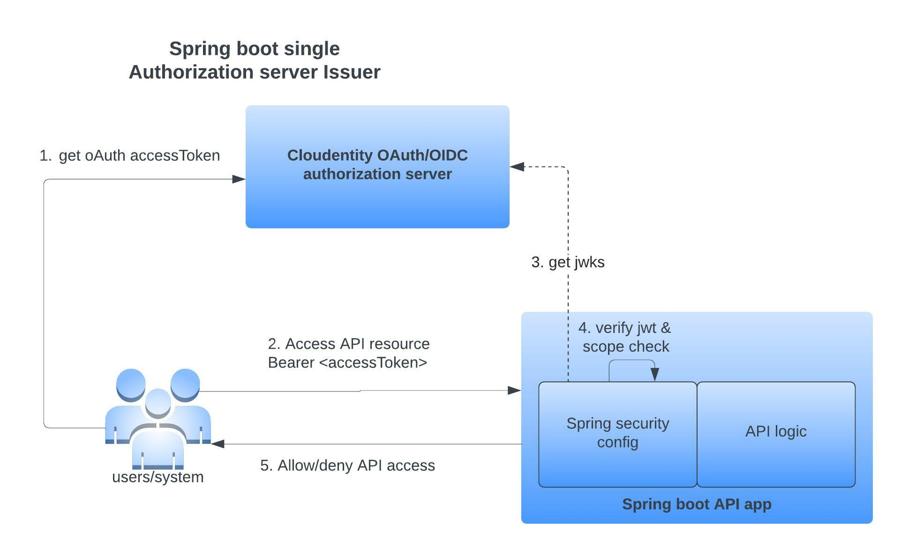

## Overview

This project has a sample Spring boot application that models an API resource server.
This project also showcases the configuration that validates the Bearer token against a single OAuth server. In this case Cloudentity will be 
the OAuth authorization server that issues the OAuth access token and associated scopes within the Bearer. Any API access using the Bearer token 
will be protected by verifying that Cloudentity is the
actual issuer of the token with Spring Security configurations.



Some of the main configurations showcased within this sample application are:
* Validate and accept only accessTokens issued by a trusted Authorization Server
* deny protected API resource access when accessed with
  * no accessToken
  * invalid accessToken
  * accessToken from a different OAuth authorization server
  * "aud" claim within accessToken not matching one of the expected values
  * issuer does not match trusted authorization server
* Programattic scope check for API resources
* Transformed jwt claims within the resource server

### Cloudentity configuration

#### Register API service within Cloudentity

Go to Cloudentity ACP and register the API service as service that depicts the OAuth resource server

[Create service](https://developer.cloudentity.com/howtos/applications/create_service/)

#### Spring boot API configuration

Once the resource server/service and scopes are defined in a remote OAuth authorization server, continue with 
below steps at the application level to configure and protect the resources using Authorization Server 
issued accessToken

All application properties are configurable and based on standard Spring integration under `src/main/resources/applciation.properties`

* Set the JWKS endpoint property - `security.oauth2.resource.jwk.key-set-uri`

This URI is used to get the key used to sign the accessToken by authorization server and 
verify integrity of the accessToken presented to resource server.

Sample entry:

```
security.oauth2.resource.jwk.key-set-uri=https://dev.ecs.authorization.cloudentity.com/default/default/.well-known/jwks.json
```

#### What gets verified in resource server?

Using minimal Spring Boot configuration, indicating the authorization server’s issuer uri, 
Resource Server will default to verifying the iss claim as well as the exp and nbf timestamp claims.

In circumstances where validation needs to be customized, Resource Server ships with two standard
validators and also accepts custom OAuth2TokenValidator instances.

https://docs.spring.io/spring-security/reference/reactive/oauth2/resource-server/jwt.html#webflux-oauth2resourceserver-jwt-validation-clockskew


#### Build using Maven and Run

```bash
make build-run-maven
```
#### Build using Gradle and Run

```bash
make build-run-gradle
```

### How to test

#### Get an accessToken from authorization server

Get an accessToken from Cloudentity authorization server using Cloudentity demo application or using
any other tools like POSTMAN.

#### Test endpoint wihout valid accessToken

```bash
curl -X GET \
  http://localhost:8080/api/jwt/info \
  -H 'Authorization: Bearer <PUT_YOUR_ACCESS_TOKEN>' 
```

Response:

```
{
    "error": "unauthorized",
    "error_description": "Full authentication is required to access this resource"
}

```

#### Test an endpoint  with valid accessToken and get jwt information

```bash
curl -X GET \
  http://localhost:8080/api/jwt/info \
  -H 'Authorization: Bearer <PUT_YOUR_ACCESS_TOKEN>' 
```

Response:

```
{
    "error": "unauthorized",
    "error_description": "Full authentication is required to access this resource"
}

```

#### Test an endpoint with scope protection enforced and an existing scope

```bash
curl -X GET \
  http://localhost:8080/api/sample/protected/openidscope \
  -H 'Authorization: Bearer <PUT_YOUR_ACCESS_TOKEN>' 
```

Response:

```
{
    "hasScope": "true"
}
```

#### Test an endpoint with scope protection enforced but non existing scope

```bash
curl -X GET \
  http://localhost:8080/api/sample/protected/nonexistentscope \
  -H 'Authorization: Bearer <PUT_YOUR_ACCESS_TOKEN>' 
```

Response:

```
{
    "error": "access_denied",
    "error_description": "Access is denied"
}

```

